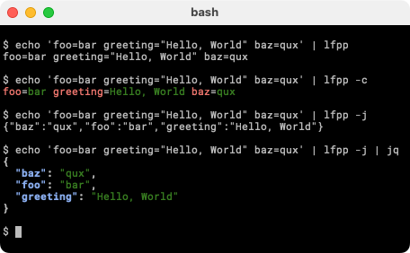

# LogFmtPrettyPrint
`lfpp` is a logfmt pretty printer. It reads logfmt from stdin and outputs either colorized (`-c`) or json (`-j`).
## Install
`go install github.com/transacid/lfpp@latest`
## Usage
```
$ echo 'foo=bar greeting="Hello, World" baz=qux' | lfpp -j

{"baz":"qux","foo":"bar","greeting":"Hello, World"}
```
